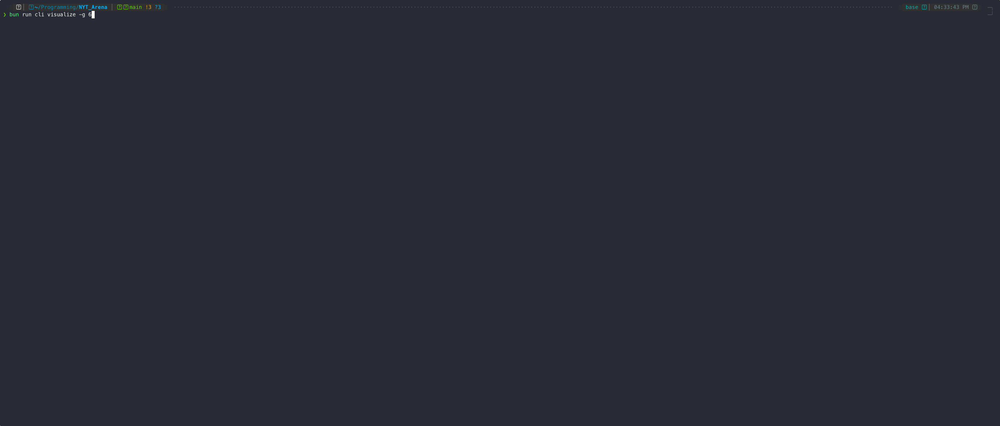

# NYT Arena

[](https://bun.sh)
[](https://www.typescriptlang.org/)
[](https://openrouter.ai/)
[](https://react.dev/)
[](https://github.com/vadimdemedes/ink)
[](LICENSE)

> 🎯 **LLM Benchmark for NYT Crosswords and Connections puzzles**

Evaluate Large Language Models on interactive puzzle-solving tasks with real-time progress tracking, concurrent execution, detailed metrics, and game-like visualizations.



---

## ✨ Features

| Feature | Description |
|---------|-------------|
| 🎯 **Game-Faithful Feedback** | Environments emulate exact NYT game mechanics |
| 🔄 **Concurrent Workers** | Per-model workers run in parallel |
| 📊 **Live Dashboard** | Beautiful real-time CLI with progress, metrics, activity |
| 🎮 **Game Visualization** | Pure Ink (React) TUI with fixed 4×4 grid, animated transitions |
| 🏆 **Global Leaderboard** | Aggregate statistics across all runs with trends and rankings |
| 💰 **Cost Tracking** | Token usage and OpenRouter API costs |
| ⚡ **Performance Metrics** | Tokens/sec, solve times, latency tracking |
| 📝 **Detailed Tracing** | Every step persisted with full context |
| ✅ **Structured Outputs** | JSON schema enforcement for reliable parsing |

---

## 🚀 Quick Start

### Prerequisites

- [Bun](https://bun.sh/) runtime (v1.0+)
- [OpenRouter API key](https://openrouter.ai/keys)

### Installation

```bash
# Clone the repository
git clone https://github.com/yourusername/NYT_Arena.git
cd NYT_Arena

# Install dependencies
bun install

# Set up environment variables
cp .env.example .env
# Edit .env and add your OPENROUTER_API_KEY
```

### First Run

```bash
# 1. Normalize puzzle data (918 connections puzzles)
bun run normalize:connections

# 2. List available puzzles
bun run list -t connections

# 3. Run a benchmark (dry run first)
bun run run:suite -s suites/connections-test.json --dry-run

# 4. Run the actual benchmark with live dashboard
bun run run:suite -s suites/connections-test.json

# 5. Visualize the results
bun run cli visualize
```

---

## 🎮 Run Visualization

After running benchmarks, use the `visualize` command to replay runs with an animated, game-like display that mirrors the actual NYT Connections interface.

### Visualization Features

- **Fixed 4×4 Grid** - Consistent grid dimensions maintained throughout gameplay
- **Pure Ink Components** - Built entirely with React for terminals (no hand-coded ANSI)
- **Animated Transitions** - Watch the game unfold step by step with smooth updates
- **Color-Coded Groups** - Found groups stack at top with difficulty colors (🟨 yellow, 🟩 green, 🟦 blue, 🟪 purple)
- **Hearts Indicator** - Visual mistakes remaining (♥ ♥ ♥ ♥)
- **Progress Bar** - Track completion percentage with gradient fills
- **Interactive Mode** - Step through at your own pace with keyboard
- **Multi-Game Grid** - Watch multiple games side-by-side in a grid layout
- **Rounded Borders** - Clean card-based design with flexbox layouts

### Usage

```bash
# List all available runs
bun run cli visualize --list

# Watch the most recent run (auto-play)
bun run cli visualize

# Watch a specific run by ID
bun run cli visualize -r <runId>

# Watch runs by a specific model (most recent)
bun run cli visualize -m gemini
bun run cli visualize -m claude
bun run cli visualize -m gpt

# Watch runs for a specific puzzle
bun run cli visualize -p 2023-06-12

# Control animation speed (milliseconds between steps)
bun run cli visualize --speed 500      # Faster
bun run cli visualize --speed 3000     # Slower

# Interactive mode - step through with keyboard
bun run cli visualize -i
# Press SPACE or ENTER to advance, Q to quit

# Multi-game grid view - watch 6 games at once
bun run cli visualize -g 6

# Customize grid columns (default: 3)
bun run cli visualize -g 9 --columns 3

# Combine options: 4 games, fast, interactive
bun run cli visualize -g 4 --columns 2 --speed 500 -i
```

### Single Game View

```
  ╔════════════════════════════════════════════════════════════╗
  ║                     🎯 NYT CONNECTIONS                     ║
  ╚════════════════════════════════════════════════════════════╝

  Model:  google/gemini-3-flash-preview
  Puzzle: connections-2023-06-12    Step: 2/4

  Mistakes remaining: ❤️ ❤️ ❤️ ❤️

  ╭────────────────────────────────────────────────────────────╮
  │                       WET WEATHER                          │
  │                 HAIL, RAIN, SLEET, SNOW                    │
  │                                                            │
  │    BUCKS          SHIFT          OPTION          MOM       │
  │     JAZZ          LEVEL          RETURN          TAB       │
  │   RACECAR          NETS           HEAT          KAYAK      │
  ╰────────────────────────────────────────────────────────────╯

  ✅ ✓ WET WEATHER

  Progress: [████████████████████░░░░░░░░░░░░░░░░░░░░] 50%

  [SPACE/ENTER] Next step  [Q] Quit
```

### Multi-Game Grid View

Watch multiple runs simultaneously with `--grid`:

```
  ╔══════════════════════════════════════════════════════════════════════╗
  ║               🎯 NYT ARENA - MULTI-GAME VISUALIZATION                ║
  ╚══════════════════════════════════════════════════════════════════════╝

  Step 3/12  [█████████████░░░░░░░░░░░░░░░░░░░░░░░░░░░░░░░░░░░░░] 25%
  Watching 6 games

  ╭─gemini-2.5-flash──────────────╮  ╭─gemini-3-flash────────────────╮  ╭─claude-haiku────────────────────╮
  │ 🎮 3/12  ❤️❤️❤️❤️             │  │ ✅ 3/4  ❤️❤️❤️❤️              │  │ 🎮 3/8  ❤️❤️🖤🖤               │
  ├──────────────────────────────┤  ├──────────────────────────────┤  ├────────────────────────────────┤
  │       STREAMING SERVICES     │  │       STREAMING SERVICES     │  │  HULU     PRIME   NETFLIX  DOWN │
  │  MUSTARD  TARTAR   KETCHUP   │  │          NBA TEAMS           │  │  BLUE     GLUM    LOW     PLUM  │
  │  BLUE     SCARLET  RELISH    │  │  SHIFT    OPTION   RETURN    │  │  GREEN    MAYO    MUSTARD RELISH│
  │  GREEN    MAYO     LOW       │  │  TAB      MOM      LEVEL     │  │  KETCHUP  TARTAR  SCARLET PEACOCK│
  ├──────────────────────────────┤  ├──────────────────────────────┤  ├────────────────────────────────┤
  │ ✓ STREAMING SERVICES         │  │ ✓ NBA TEAMS                  │  │ One away!                      │
  ╰──────────────────────────────╯  ╰──────────────────────────────╯  ╰────────────────────────────────╯

  Press Ctrl+C to exit
```

### Visualize Command Options

| Option | Description |
|--------|-------------|
| `-r, --run <runId>` | Visualize a specific run by ID |
| `-m, --model <modelId>` | Filter by model name (partial match) |
| `-p, --puzzle <puzzleId>` | Filter by puzzle ID (partial match) |
| `-l, --list` | List recent runs in a table |
| `-n, --limit <n>` | Number of runs to list (default: 10) |
| `-s, --speed <ms>` | Animation speed in milliseconds (default: 1500) |
| `-i, --interactive` | Step through with keyboard controls |
| `-g, --grid <n>` | Watch n games in a grid layout |
| `--columns <n>` | Number of columns in grid view (default: 3) |
| `-o, --output <dir>` | Runs directory (default: "runs") |

---

## 🏆 Global Leaderboard

View aggregate statistics and rankings across all completed runs:

```bash
# View overall leaderboard
bun run cli leaderboard

# Filter by game type
bun run cli leaderboard --type connections

# Filter by date (runs since a specific date)
bun run cli leaderboard --since 2024-01-01

# Show top 10 models only
bun run cli leaderboard --limit 10

# Sort by different metrics
bun run cli leaderboard --sort wins      # Total wins (default)
bun run cli leaderboard --sort rate      # Win rate percentage
bun run cli leaderboard --sort cost      # Lowest cost
bun run cli leaderboard --sort tokens    # Total tokens used
bun run cli leaderboard --sort speed     # Fastest tokens/sec
```

### Leaderboard Display

```
🏆 Global Leaderboard - Connections
━━━━━━━━━━━━━━━━━━━━━━━━━━━━━━━━━━━━━━━━━━━━━━━━━━━━━━━━━━━━━━━━━━━━━━━━━━━━━━━━━━━━━━━━━━━━━━━━
Rank  Model                              Wins  Loss  Rate     Tokens    Cost        Tok/s    Trend
━━━━━━━━━━━━━━━━━━━━━━━━━━━━━━━━━━━━━━━━━━━━━━━━━━━━━━━━━━━━━━━━━━━━━━━━━━━━━━━━━━━━━━━━━━━━━━━━
🥇  google/gemini-3-flash-preview       15    10    60.0%    342.5K    $0.1234     298/s    ↗️ W3
🥈  anthropic/claude-3-haiku             12    8     60.0%    456.2K    $0.2341     245/s    ↗️ W2  
🥉  openai/gpt-4o-mini                   11    9     55.0%    298.1K    $0.0987     312/s    ↘️ L1
4   google/gemini-2.5-flash              8     12    40.0%    287.3K    $0.0912     198/s    ↘️ L2

Top 5 Win Rate History:
▁▂▃▅██ google/gemini-3-flash-preview
▂▃▄▅▆█ anthropic/claude-3-haiku
▄▅▅▆▅▅ openai/gpt-4o-mini
▆▅▄▃▃▂ google/gemini-2.5-flash
```

### Leaderboard Features

- **Aggregate Statistics** - Combines all runs across all suites
- **Win/Loss Tracking** - Total games won and lost per model
- **Cost Analysis** - Total API costs and efficiency metrics
- **Performance Trends** - Win/loss streaks with arrows (↗️ ↘️)
- **Sparkline Charts** - Visual win rate history for top models
- **Flexible Filtering** - By game type, date range, and sort criteria
- **Medal Rankings** - Top 3 models highlighted with 🥇🥈🥉

---

## 📊 Live Dashboard

When you run a benchmark, you'll see a real-time dashboard:

```
╔══════════════════════════════════════════════════════════════════════════════╗
║ 🎯 NYT Arena Benchmark │ connections-test │ ⠋ Running │ ⏱ 1m 23s            ║
╚══════════════════════════════════════════════════════════════════════════════╝
Overall Progress: [████████████░░░░░░░░░░░░░░░░░░░] 38.5% (5/13)
════════════════════════════════════════════════════════════════════════════════
📊 Global Statistics
Progress: 5/13 (38.5%)       Total Tokens: 12.5K      Total Cost: $0.0042
✓ Success: 3                 ├ Prompt: 10.2K          Total Time: 45.2s
✗ Failed: 2                  └ Completion: 2.3K       Fastest Solve: 3.2s
⏱ Timeout: 0                 Tokens/sec: 276.4        Slowest Solve: 12.1s
────────────────────────────────────────────────────────────────────────────────
🤖 Model Workers
Model                           Progress    W/L       Rate      Tokens    Tok/s     Cost      Status
────────────────────────────────────────────────────────────────────────────────
● openai/gpt-4o-mini            2/5        2/0       100%      4.2K      312/s     $0.0015   ⠋ Step 3
● anthropic/claude-3-haiku      2/5        1/1       50%       5.1K      245/s     $0.0018   ⠋ Step 5
● google/gemini-2.0-flash       1/3        0/1       0%        3.2K      198/s     $0.0009   ⠋ Step 2
────────────────────────────────────────────────────────────────────────────────
📜 Recent Activity
✓ openai/gpt-4o-mini solved connections-2023-06-13
→ anthropic/claude-3-haiku step 4 (156 tok) 892ms
→ google/gemini-2.0-flash step 1 (203 tok) 1.2s
▶ openai/gpt-4o-mini started connections-2023-06-14
```

### 🏆 Final Leaderboard

When complete, see the final rankings:

```
╔══════════════════════════════════════════════════════════════════════════════╗
║ 🎉 NYT Arena Benchmark Complete! │ connections-test │ Total Time: 5m 23s    ║
╚══════════════════════════════════════════════════════════════════════════════╝

📊 Overall Results
────────────────────────────────────────────────────────────────────────────────
Total Runs: 15          ✓ Solved: 10         Total Tokens: 45.2K    Total Cost: $0.0156
Success Rate: 66.7%     ✗ Failed: 5          Avg Tokens/s: 289.3    API Time: 2m 36s

🏆 Model Leaderboard
────────────────────────────────────────────────────────────────────────────────
#    Model                                  Success %   W/L       Tokens      Tok/s       Cost
────────────────────────────────────────────────────────────────────────────────
🥇  openai/gpt-4o-mini                      80.0%      4/1       12.3K       312.4/s     $0.0045
🥈  anthropic/claude-3-haiku-20240307       60.0%      3/2       18.5K       245.1/s     $0.0062
🥉  google/gemini-2.0-flash-001             60.0%      3/2       14.4K       198.7/s     $0.0049
```

---

## 📖 CLI Commands

```bash
# Main CLI help
bun run cli --help

# Run a benchmark suite (with dashboard)
bun run cli run -s <suite.json> [-o <output-dir>] [--dry-run] [--no-dashboard]

# Visualize completed runs
bun run cli visualize [options]

# View global leaderboard (aggregate stats from all runs)
bun run cli leaderboard [--type connections|crossword] [--since <date>] [--limit <n>]

# Normalize raw data
bun run cli normalize -t connections|crossword

# List available puzzles
bun run cli list [-t <type>] [-l <limit>]

# List OpenRouter models
bun run cli models [-f <filter>]
```

### Command Reference

| Command | Description |
|---------|-------------|
| `run` | Execute a benchmark suite with live dashboard |
| `visualize` | Replay runs with animated game-like visualization |
| `leaderboard` | View global statistics and rankings across all runs |
| `normalize` | Convert raw puzzle data to normalized format |
| `list` | Display available puzzles |
| `models` | Query available models from OpenRouter |

---

## ⚙️ Suite Configuration

Create a JSON file in `suites/`:

```json
{
  "name": "my-benchmark",
  "description": "Benchmark description",

  "models": [
    "openai/gpt-4o-mini",
    "anthropic/claude-3-haiku-20240307",
    "google/gemini-2.0-flash-001"
  ],

  "puzzles": {
    "type": "connections",
    "dateRange": { "start": "2023-06-12", "end": "2023-12-31" },
    "limit": 10,
    "shuffle": false
  },

  "repeats": 1,
  "maxSteps": 20,
  "runTimeoutMs": 180000,
  "stepTimeoutMs": 30000,

  "maxConcurrentRuns": 5,
  "maxConcurrentRequests": 10,

  "openRouter": {
    "includeUsage": true,
    "temperature": 0,
    "maxTokens": 512
  },

  "maxInvalidActions": 5
}
```

---

## 📁 Project Structure

```
NYT_Arena/
├── src/
│   ├── cli/                  # Command-line interface
│   ├── client/               # OpenRouter API client
│   ├── dashboard/            # Ink-based live dashboard
│   │   ├── App.tsx           # Main dashboard app
│   │   ├── Dashboard.tsx     # Live progress view
│   │   ├── FinalSummary.tsx  # Completion leaderboard
│   │   └── types.ts          # State management
│   ├── data/                 # Data normalization scripts
│   ├── environments/         # Game simulators
│   │   ├── ConnectionsEnv.ts # NYT Connections game
│   │   └── CrosswordEnv.ts   # NYT Crossword game
│   ├── leaderboard/          # Global leaderboard
│   │   └── index.ts          # Aggregate statistics
│   ├── runner/               # Benchmark runners
│   │   ├── runner.ts         # Legacy runner
│   │   └── concurrent-runner.ts # Per-model workers
│   ├── schemas/              # Zod validation schemas
│   └── visualizer/           # Run visualization
│       ├── components/       # Pure Ink React components
│       │   ├── GameCard.tsx  # Fixed 4×4 game card
│       │   ├── MultiGameVisualizer.tsx # Grid view
│       │   ├── SingleGameVisualizer.tsx # Single game
│       │   └── App.tsx       # Main visualizer app
│       └── index.ts          # Entry point
├── data/
│   ├── raw/                  # Raw puzzle data
│   └── normalized/           # Canonical JSON format
├── suites/                   # Benchmark configurations
├── runs/                     # Output artifacts (per-run steps & summaries)
└── reports/                  # Generated reports
```

---

## 🎮 Supported Games

### Connections

| Feature | Details |
|---------|---------|
| **Objective** | Group 16 words into 4 categories of 4 |
| **Mistakes** | 4 allowed before game over |
| **Feedback** | Correct, incorrect, "one away" hints |
| **Actions** | `submit_group`, `give_up` |
| **Puzzles** | 918+ available (June 2023 - present) |
| **Visualization** | Full animated grid replay |

### Crossword

| Feature | Details |
|---------|---------|
| **Objective** | Fill the grid based on clues |
| **Actions** | `fill_entry`, `clear_entry`, `check_entry`, `submit_puzzle`, `give_up` |
| **Options** | `allowChecks`, `allowReveals` (suite config) |
| **Puzzles** | NYT crosswords 1977-2018 (requires re-acquisition) |
| **Visualization** | Static step-by-step replay |

---

## 📈 Metrics Tracked

| Category | Metrics |
|----------|---------|
| **Progress** | Runs completed, per-model progress |
| **Results** | Success/fail/timeout/error counts |
| **Tokens** | Prompt, completion, total, tokens/sec |
| **Cost** | Per-step, per-model, total API cost |
| **Timing** | Latency, solve times, fastest/slowest |
| **Game** | Steps to solve, mistakes made, groups found |

---

## 🔧 Development

```bash
# Run TypeScript checks
bun run typecheck

# Run tests
bun test

# List normalized puzzles
bun run list -t connections -l 20

# Test visualizer
bun run cli visualize --list
```

---

## 🌐 Environment Variables

| Variable | Description | Required |
|----------|-------------|----------|
| `OPENROUTER_API_KEY` | OpenRouter API key | ✅ Yes |
| `LOG_LEVEL` | Logging level (debug, info, warn, error) | ❌ No |

---

## 📋 Workflow Example

Here's a complete workflow from setup to visualization:

```bash
# 1. Setup
bun install
cp .env.example .env
# Add your OPENROUTER_API_KEY to .env

# 2. Prepare data
bun run cli normalize -t connections

# 3. Create a test suite (or use existing)
cat > suites/quick-test.json << 'EOF'
{
  "name": "quick-test",
  "models": ["google/gemini-2.0-flash-001"],
  "puzzles": { "type": "connections", "limit": 3 },
  "repeats": 1,
  "maxSteps": 20,
  "openRouter": { "temperature": 0, "maxTokens": 512 }
}
EOF

# 4. Run benchmark
bun run cli run -s suites/quick-test.json

# 5. List completed runs
bun run cli visualize --list

# 6. Watch the most recent run
bun run cli visualize

# 7. Watch interactively (step through with spacebar)
bun run cli visualize -i

# 8. Watch a specific run at high speed
bun run cli visualize -r <runId> --speed 500

# 9. Watch multiple games in a grid (great for comparing models!)
bun run cli visualize -g 6 --columns 3

# 10. Multi-game grid with interactive stepping
bun run cli visualize -g 4 --columns 2 -i --speed 1000
```

---

## 🙏 Acknowledgments

- [OpenRouter](https://openrouter.ai/) - Unified LLM API access
- [Ink](https://github.com/vadimdemedes/ink) - React for CLI
- [Bun](https://bun.sh/) - Fast JavaScript runtime
- NYT Games - Original puzzle formats
- Community datasets - Puzzle data sources